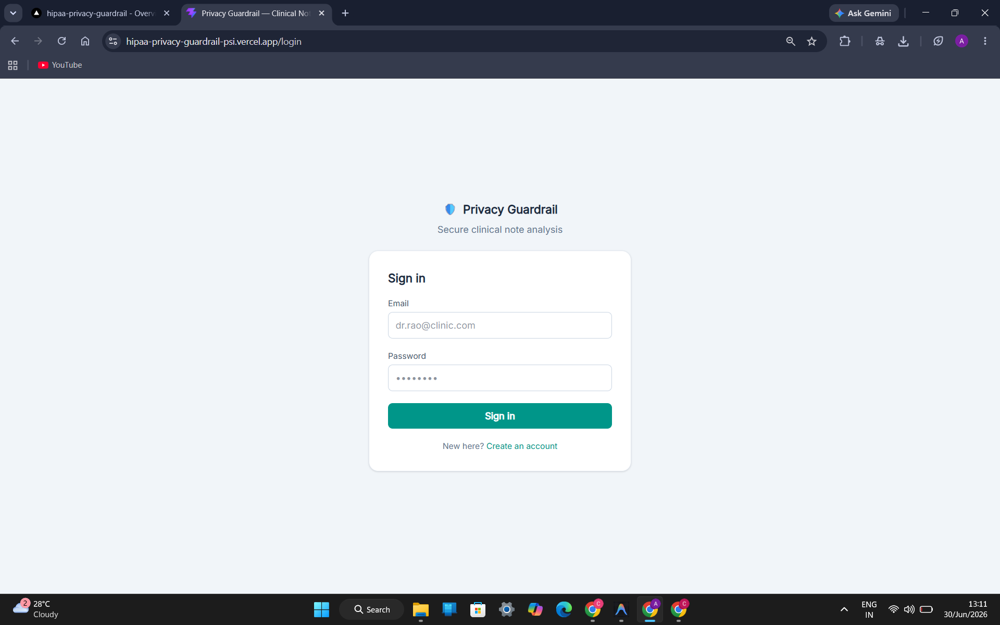
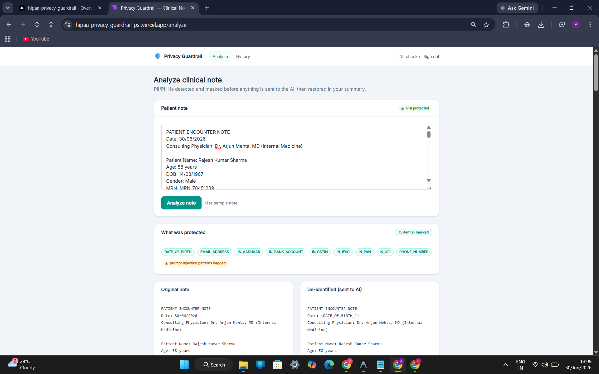
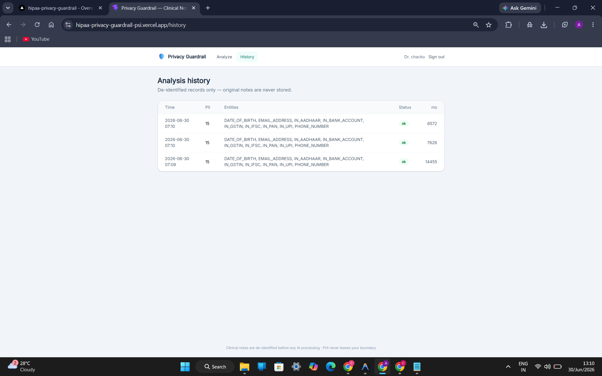

# 🏥 AI Privacy & Compliance Gateway

**A privacy-preserving middleware layer for sending sensitive data to LLMs safely — demonstrated through a HIPAA-inspired clinical note use case.**

[Architecture](#-architecture) · [Installation](#-installation)


---

## Screenshots

**Sign in** — clinicians authenticate before submitting any patient data.

<p align="center">
  
</p>

**Analyze a clinical note** — PII/PHI is detected and masked before anything reaches the AI, with the original and de-identified versions shown side by side.

<p align="center">
  
</p>

**Analysis history** — every request is logged with the entity types masked, status, and processing time. Original notes are never stored.

<p align="center">
  
</p>

---

## Why This Exists

Large Language Models cannot safely receive raw sensitive data. Sending unmasked clinical notes, financial records, or legal documents directly to a third-party AI provider creates privacy, compliance, and regulatory exposure.

This project inserts a dedicated **privacy gateway** between the client and the LLM. The gateway detects sensitive entities, masks them before the request leaves your infrastructure, sends only de-identified text to the model, and restores the original values once the AI response comes back — all while keeping an auditable record of every request.

The healthcare scenario (clinical note summarization) is used here as a concrete example, but the same pattern applies to finance, legal, and other domains where sensitive data meets an LLM.

---

## Features

| Feature | Description |
|---|---|
| PII/PHI Detection | Scans incoming text and identifies sensitive entities before processing |
| De-identification | Replaces detected entities with reversible tokens |
| Secure Rehydration | Restores original values in the AI response after inference |
| Audit Logging | Records every request for traceability and compliance review |
| AI Summarization | Uses Google Gemini to analyze the de-identified note |
| Cloud Deployment | Frontend on Vercel, backend on Render, logs in Supabase |

---

## Architecture

<p align="center">
  
</p>

### Request Lifecycle

1. Client submits a clinical note to the gateway.
2. Gateway detects PII/PHI entities in the text.
3. Sensitive entities are replaced with reversible tokens.
4. The masked note is sent to Google Gemini for analysis.
5. Gemini returns a summary based only on de-identified text.
6. The gateway restores original values in the response.
7. The request and response are logged to Supabase for audit purposes.
8. The final, restored summary is returned to the user.

---

## Tech Stack

| Layer | Technology |
|---|---|
| Frontend | React + Vite |
| HTTP Client | Axios |
| Backend / Gateway | Node.js + Express |
| AI Provider | Google Gemini API |
| Database / Audit Store | Supabase (PostgreSQL) |
| Config | dotenv |
| Deployment | Vercel (frontend), Render (backend) |

---

## Project Structure

```
hipaa-privacy-guardrail/
│
├── frontend/              # React client
│   ├── src/
│   ├── components/        # UI components
│   ├── services/          # API calls to the backend gateway
│   └── ...
│
├── backend/                # Express gateway
│   ├── config/             # Environment & service configuration
│   ├── routes/              # API endpoints
│   ├── services/            # PII detection, masking, rehydration, Gemini calls
│   ├── server.js
│   └── ...
│
└── README.md
```

---

## Installation

### Clone the repository

```bash
git clone https://github.com/Yami2912/hipaa-privacy-guardrail.git
```

### Backend

```bash
cd backend
npm install
npm run dev
```

### Frontend

```bash
cd frontend
npm install
npm run dev
```

### Environment variables

Both `frontend/` and `backend/` expect a `.env` file with the relevant API keys (Gemini API key, Supabase URL/key, etc.). See `.env.example` in each directory for the required variables.

---

## Security

- Patient identifiers are masked before any data reaches the AI provider.
- API keys and secrets are managed exclusively through environment variables, never committed to source.
- Every request is logged to support traceability and compliance review.
- This project demonstrates a HIPAA-*inspired* de-identification workflow — it is not, on its own, a certified HIPAA-compliant system.

---

## Key Design Decisions

**Tokenization instead of deletion.** Entities are replaced with reversible tokens rather than stripped out, so the AI's response can be rehydrated with the real values afterward without losing clinical context.

**Rehydration happens after inference.** The LLM only ever sees masked data; original values are reintroduced server-side once the response is generated, so sensitive data never needs to round-trip through the model.

**The gateway is separate from the frontend.** Keeping masking, logging, and provider calls in a dedicated backend layer means the same gateway could sit in front of any client, not just this React app.

**Every request is audited.** Logging requests (not their raw contents) supports accountability and gives a paper trail for compliance review.

---

## Roadmap

**Completed**
- [x] PII/PHI detection and masking
- [x] Gemini-based summarization
- [x] Rehydration after inference
- [x] Audit logging to Supabase

**Planned**
- [ ] User authentication and role-based access control
- [ ] Streaming responses
- [ ] PDF report generation
- [ ] OCR support for scanned medical records
- [ ] Exportable analysis history
- [ ] Docker containerization
- [ ] Unit and integration testing
- [ ] Multi-provider LLM support (provider abstraction layer)
- [ ] Additional compliance modes (GDPR, DPDP) — experimental

---

## Author

**Yami Patel**
GitHub: [@Yami2912](https://github.com/Yami2912)

---

## License

This project is intended for educational and portfolio purposes. It demonstrates a secure pattern for handling sensitive text with AI and is not intended for production healthcare environments without additional compliance, security, and regulatory measures.
